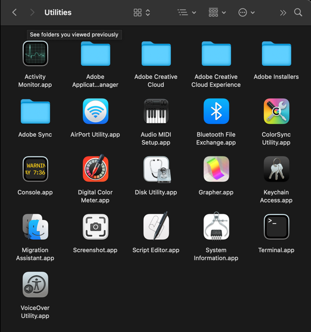
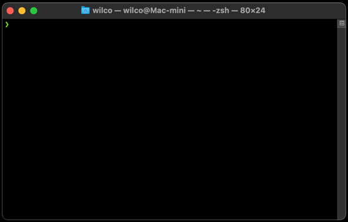
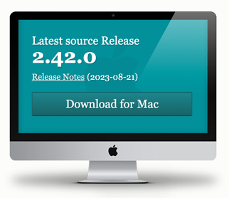

# How to Setup a Mac for development purposes

This is likely going to be an on-going exercise as application needs change over time. For now, we should be satisfied that all our efforts will not be lost.

Our first steps after instantiating an account is either migrating an old user over to the new machine from an older mac system or just starting fresh.

Once on your computer, let's get a few things started:

## Startup Terminal

We will be working with a terminal window, safari and chrome / firefox eventually. In the meantime, we need our **cli**! Let's kickstart the process by either navigating to the `Application > Utilities` folder and selecting `Terminal` app.



The below image demonstrates what a terminal window might look like (especially if you have Dark Mode on)



Some of you may wish to upgrade or install a different terminal application. I use iTerm. I'll explain how to install that later.

## Install or update XCODE

This is going to be the biggest task as it can take a while to update, but well worth it:

```shell
xcode-select --install
```

This might tell you that your **xcode** is up-to-date. Check to see if you are in fact running the latest version of git:

```shell
git --version
```

Now, to see which version is available, go here [git-scm.com](https://git-scm.com/downloads). On the screen you should see something like this:



If you version doesn't match, we'll get a newer version using Brew.

> You can uninstall **XCode** and restart from fresh by doing `sudo rm -rf /Library/Developer/CommandLineTools` from a command line terminal. Once that is done, head back up to the first step and install xcode.

## Install Brew

You can find brew here [brew.sh](https://brew.sh/)
```shell
/bin/bash -c "$(curl -fsSL https://raw.githubusercontent.com/Homebrew/install/HEAD/install.sh)"
```

This should download an install script and launch it. Once completed, you should be able to check your `brew` version.

```shell
brew --version
```

You are looking for an output that looks similar to this:

```shell
Homebrew 4.1.11
```

A good command to remember is how to check what Brew is up to!

```shell
brew services list
```

The following is an example of what is running on my Brew service list.

```shell
Name    Status  User  File
php     none
php@8.1 started wilco ~/Library/LaunchAgents/homebrew.mxcl.php@8.1.plist
```

## Install Git

We recommend installing and maintaining git from brew.

```shell
brew install git
```

## Install a suite of tools

Now we can focus on get a bunch of tools installed which will make life easier:

```shell
brew install --cask slack
brew install --cask google-chrome
brew install jq
brew install yq
```

## Install PHP - but first...

To install php, I recommend going here - [php formula](https://formulae.brew.sh/formula/php) - and see your options. Since there are several versions, understanding how to install, switch and update will be helpful.

> NOTE: Mac's come with php, apache and mysql available. Since we do not wish to use them, we'll disable them first.

### Uninstall PHP

I recommend just moving php out of the way. First thing to do is check where its installed:

```shell
which php
```

Now check which version is running:

```shell
php -v
```

Run the following steps - make sure to update the statement with your version for the # sign.

```shell
sudo mv /usr/bin/php /usr/bin/php#
```

### Uninstall Apache

The next thing we should do is check that Apache is not running:

```shell
sudo lsof -i:80
```

> You may have to enter your password to see.

It might look something like this:

```shell
COMMAND     PID  USER   FD   TYPE             DEVICE SIZE/OFF NODE NAME
trustd      808 wilco   14u  IPv4 0x8e4dc569e573654b      0t0  TCP 192.168.1.166:57718->yyz12s07-in-f3.1e100.net:http (ESTABLISHED)
```

If it's running, we are going to stop the built-in Apache server:

```shell
sudo apachectl -k stop
```

Enter administrator password.

Next run this launchctl unload command:

> This is all for MacOS Ventura M2

```shell
sudo launchctl unload -w /System/Library/LaunchDaemons/org.apache.httpd.plist 2>/dev/null 
```

### Uninstall MySQL

Follow these instructions if you do not want MySQL on your machine [uninstall mysql](https://macpaw.com/how-to/uninstall-mysql-on-mac).

Its usually not on, so you should be fine to ignore this step.

```shell
brew install php
```

You can also specify a version this way:

```shell
brew install php@8.1
```

> It's important to read the documentation and also pay close attention to any post installation instructions Brew offers. You might find sometimes it suggests performing some extra steps, usually with a simple copy and paste approach.

